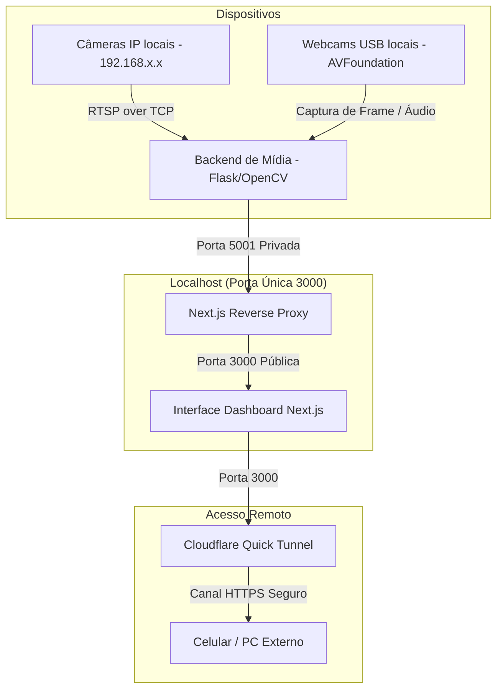

# 🎥 IP Camera Hub Live & Autodiscover

Uma central de monitoramento inteligente e distribuível de nível profissional para **câmeras IP (ONVIF/RTSP)** e **webcams USB locais**. 

Esta central foi projetada com foco em **extrema facilidade de uso** (instalação com um único comando) e **segurança/mobilidade** (exposição externa por link HTTPS seguro sem precisar configurar o roteador).

---

## ✨ Principais Diferenciais e Funcionalidades

1. **🚀 Instalação com Um Comando (`install.sh`)**:
   Detecta automaticamente seu sistema operacional (macOS ou Linux), instala interpretadores e dependências necessárias (`Node.js`, `NPM`, `Python 3`, `pip`, `FFmpeg`) usando o gerenciador de pacotes nativo (`brew`, `apt`, `dnf`, `pacman`), cria um ambiente virtual Python isolado (`venv`) e compila o bundle Next.js de alta performance para produção.

2. **🌐 Varredura & Descoberta Automática Plugar-e-Usar (Plug and Play)**:
   * **Varredura IP Concorrente**: Identifica dinamicamente seu IP e prefixo da sub-rede local, disparando uma busca paralela rápida (`ThreadPoolExecutor` com 100 threads) em todas as 254 possibilidades na classe C ativa para portas `554` (RTSP) e `8080` (ONVIF).
   * **Varredura USB Estendida**: Inspeciona até 8 slots de hardware de webcam locais (`0` a `7`) utilizando drivers nativos do sistema.
   * **Grade Dinâmica**: A interface do Next.js monitora o inventário do backend em tempo real e adapta o mosaico para renderizar automaticamente todas as câmeras descobertas (ex: 2 IPs e 3 USBs simultâneas), eliminando configurações estáticas hardcoded.

3. **🎛️ Consolidação sob Porta Única (Reverse Proxy)**:
   O Next.js atua como um proxy reverso transparente em nível corporativo (`next.config.mjs`). Todas as requisições de mídia do painel (`/status`, `/stream`, `/capture`, `/ptz`, `/audio`) são redirecionadas silenciosamente em segundo plano para o microserviço Python Flask na porta `5001`. **Benefício:** Zero problemas de CORS e exposição total de áudio/vídeo sobre a **única porta 3000**!

4. **🎙️ Áudio Live Transcodificado em Tempo Real (RTSP e USB)**:
   As câmeras enviam áudio encapsulado no fluxo de mídia. Ao clicar no botão de microfone (Unmute) na interface, o backend inicia um subprocesso de alta performance do `FFmpeg` que captura o áudio físico do dispositivo (ou fluxo RTSP/TCP), realiza a transcodificação instantânea para **MP3** (`libmp3lame` a 64k mono e 16kHz) e transmite o stream binário diretamente por uma conexão contínua (`pipe:1`), compatível com o elemento `<audio>` nativo dos navegadores modernos.

5. **🕹️ Controle PTZ (Pan/Tilt) Integrado**:
   Painel direcional D-Pad flutuante de última geração baseado em requisições de rede `POST` que geram envelopes SOAP XML estruturados enviados diretamente à rota `/onvif/ptz_service` da câmera IP na porta `8080` (comandos `ContinuousMove` e `Stop`).

6. **☁️ Exposição Pública com Um Clique (Cloudflare Tunnel)**:
   Ao rodar a central, o orquestrador oferece o provisionamento automático de um túnel seguro. Ele detecta a presença do `cloudflared` ou baixa o binário standalone oficial correspondente à sua arquitetura de CPU, gerando um link HTTPS externo e criptografado gratuito (ex: `https://*.trycloudflare.com`). **Isso permite monitorar suas câmeras do celular no 4G/5G com áudio completo, sem abrir portas no seu modem doméstico.**

7. **🧹 Desligamento Limpo (`Ctrl+C`)**:
   O script de controle (`start.sh`) implementa um escutador de interrupções (`trap cleanup SIGINT SIGTERM`) que garante que, ao fechar a aplicação no terminal, todos os processos rodando em background (Flask, Next.js de produção e Cloudflare Tunnel) sejam finalizados de forma limpa, liberando as portas do host.

---

## 🛠️ Arquitetura do Sistema



---

## 🚀 Como Instalar e Executar

### Pré-requisitos
* Um computador rodando **macOS** ou **Linux** (Debian, Ubuntu, Fedora, Arch Linux).
* Conexão com a internet para download inicial de dependências.

---

### Instalação Automática de Um Comando

Basta rodar o instalador autônomo na raiz do repositório clonado:

```bash
chmod +x install.sh
./install.sh
```

*(O script cuidará de verificar a presença do Node.js, Python, FFmpeg, Homebrew e instalar o que estiver faltando, além de compilar o painel Next.js).*

---

### Executando a Central

Inicie o painel e o túnel público rodando:

```bash
./start.sh
```

Durante o boot, o script perguntará:
`Ativar Túnel Externo? (s/N): `

* Digite **`s`** para habilitar o link público seguro para acessar do celular de qualquer lugar do mundo.
* Digite **`n`** para rodar apenas localmente em sua rede Wi-Fi.

O console exibirá os endereços de acesso:

```text
======================================================================
            SISTEMA DE MONITORAMENTO PÚBLICO ATIVO!                   
======================================================================
Acesse seu painel com segurança de qualquer lugar do mundo no link:
  URL Pública: https://dynamic-words.trycloudflare.com
======================================================================

======================================================================
    IP CAMERA HUB ATIVO LOCALMENTE!
======================================================================
Acesse em sua rede local:
  Dashboard Local: http://localhost:3000
  Outros computadores: http://192.168.0.13:3000
======================================================================
```

Para desligar o sistema por completo, basta pressionar **`Ctrl + C`** no terminal.

---

## 📁 Estrutura de Arquivos Importantes

* [install.sh](file:///Users/fabio.fph/IP%20camera%20hub/install.sh): Script inteligente de provisionamento de dependências e compilação do Next.js.
* [start.sh](file:///Users/fabio.fph/IP%20camera%20hub/start.sh): Inicializador integrado com traps de encerramento, gerenciamento de túnel Cloudflare e outputs dinâmicos de IP.
* [stream_server.py](file:///Users/fabio.fph/IP%20camera%20hub/stream_server.py): Servidor Flask de mídia, responsável pelas threads de buffers de câmeras, varreduras concorrentes de rede e transcodificação FFmpeg.
* [camera-ui/next.config.mjs](file:///Users/fabio.fph/IP%20camera%20hub/camera-ui/next.config.mjs): Configuração de Reverse Proxy de porta única para contornar CORS.
* [camera-ui/src/app/page.js](file:///Users/fabio.fph/IP%20camera%20hub/camera-ui/src/app/page.js): Dashboard do monitor de vídeo responsivo com layout dinâmico reativo, controles PTZ e transições animadas.

---

## 🖥️ Como criar seu Repositório Público e Hospedar

Se você deseja enviar este projeto para o seu próprio GitHub para que outros possam clonar ou instalar diretamente da internet via comando `curl`:

1. Crie um repositório vazio e público no seu GitHub (ex: `ip-camera-hub`).
2. No terminal da sua máquina, dentro deste diretório, execute os comandos:

```bash
# Inicializa o repositório git local
git init

# Adiciona todos os arquivos (o .gitignore cuidará de deixar de fora dependências pesadas e logs)
git add .

# Registra o commit inicial
git commit -m "feat: initial commit with universal installer, single port proxy and cloudflare tunnels"

# Vincula ao seu repositório remoto criado no GitHub (substitua pelo seu link de usuário)
git remote add origin https://github.com/SEU-USUARIO/ip-camera-hub.git

# Define a branch principal como main
git branch -M main

# Envia os arquivos para o GitHub
git push -u origin main
```

Após isso, o instalador do seu projeto poderá ser disparado remotamente por qualquer pessoa rodando:

```bash
curl -fsSL https://raw.githubusercontent.com/SEU-USUARIO/ip-camera-hub/main/install.sh | bash
```

---

*Desenvolvido em parceria de Pair Programming com Antigravity (Google DeepMind Team).*
